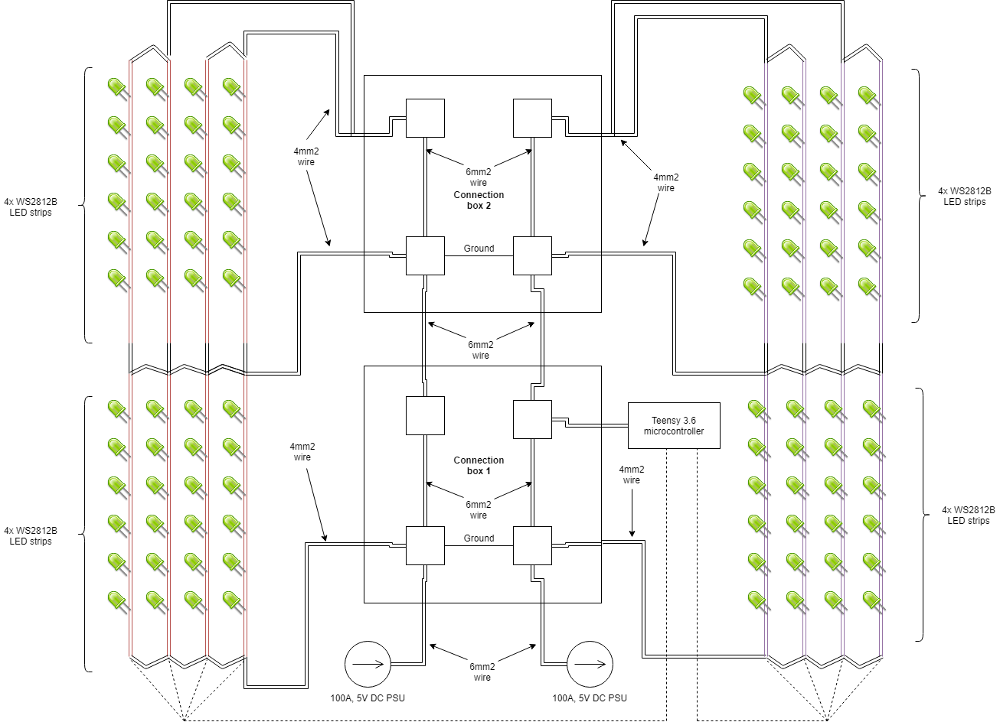
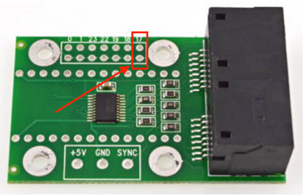

# MicroTree

This project was born as a LED installation meant to be put in a tree, hence the name of the project. It has later evolved to be a framework for building animations that can be controlled from touchOSC. It is based on the PJRC Teensy microcontroller (tested with Teensy 3.2 and 3.6 so far) in combination with the PJRC octo adaptor. An ESP8266 receives OSC packets via UDP over WIFI, and relays the OSC packets to the Teensy in order to control variables, and switch between animations. The FastLED library is used to control the LEDs.

I am trying to structure the project so that main.cpp, utility_function.cpp, osc.cpp, + their respective header files form the core. If I want to build in a new function or program I add it as a separate .cpp and .h to keep things tidy.
Each program should have all the necessary function to manipulate it's program specific parameters in the same file as the program. When I add a new program I also add a new "enum program" in main.h, and a new case for the program in the updateLEDs function in utility_functions.cpp.
Some variables are global and all programs use them. Like hue1, hue2, saturation1, saturation2, value1, value2, and some others. The idea is that I only need to define the funtions for manipulating them once, OSC messages can activate these functions, and when I add a new program I often don't have to add a lot of controls in TouchOSC because they are already there.

## Getting Started

1. Install the [Teensy Loader](https://www.pjrc.com/teensy/loader.html)
2. Install [VS Code](https://code.visualstudio.com/)
3. Install the **PlatformIO IDE** plugin in VS Code
4. In the PIO Home tab click Projects -> Add Existing and then navigate to this folder
5. Click the PlatformIO tab (Alien Icon) on the far left of the vscode window. From here you can build and upload to the Teensy.

## Wiring diagram

This wiring diagram is from my last installation of this project. I used 2x 100A, 5V PSUs, 16x 5m WS2812b LED strips (150 pixels pr strip), Teensy 3.6 with OCTOWS adaptor, and Wemos D1 mini (ESP8266).

Teensy Pinout: https://www.pjrc.com/teensy/pinout.html

## Connecting the Teensy to the ESP8266

An ESP866 can be optionally attached to the Teensy to add Wifi-based OSC control to MicroTree.

The ESP8266 code can be found here: https://github.com/harald25/esp_slipserial

### Teensy to ESP8266 Wiring
- Teensy Pin 0 to ESP8266 TX
- Teensy Pin 1 to ESP8266 RX

## Adding audio input

A 3.5mm female audio jack can optionally be added to add sound reactivity to MicroTree when it's in the VUMeter mode.

### 3.5mm jack wiring

- Teensy Pin 17 to audio jack Audio R (normally the red wire)
- Teensy Ground (All the innermost outputs on the side of the OctoWS adaptor with available pins are GND) to Audo Ground (the black or white wire depending on the cable)

## Future goals

* Document my code better. So other people can understand it, use it, and contribute to it
* Document the hardware setup
* Document the TouchOSC setup
* Upload the code for the ESP to GIT
* Add more cool programs and functionality!
  * I want a program the lets me mix other programs toghether like a DJ mixes songs together
  * ~~Fireworks effect~~
* Think out better solutions for the physical connecting and setup of all the equipment
  * Better connection box. Preferably water proof
  * Easy power connection plugs on everything

## Some example videos

https://www.youtube.com/watch?v=s0cHIyjrVMI  
https://www.youtube.com/watch?v=oguy4mDjrlk&t=1s

## Patch notes

* 2019-09-13 - Wiring diagram
  * Added wiring diagram from my latest installation of the project
* 2019-08-30 - Program Fireworks
  * Finished the first working version of Program Fireworks. I want to make some improvements to it, but for now it's going to stay like this
* 2019-08-18 - LED order array
  * Added a new function in utility_functions.cpp: void generate_led_order_array(led_order order)  
    This function fills the array led_order_array[] with a LED order depending on the specified order.  
    So far four orders are defined: NORMAL, EVERY_SECOND_STRIP_REVERSED, EVERY_STRIP_REVERSED, and STRIPS_IN REVERSE_ORDER.
  * Existing programs is rewritten to use led_order_array[] to reference pixels  
    Example: what used to be `leds[i] = CRGB::White;` is now instead `leds[led_order_array[i]] = CRGB::White;`
